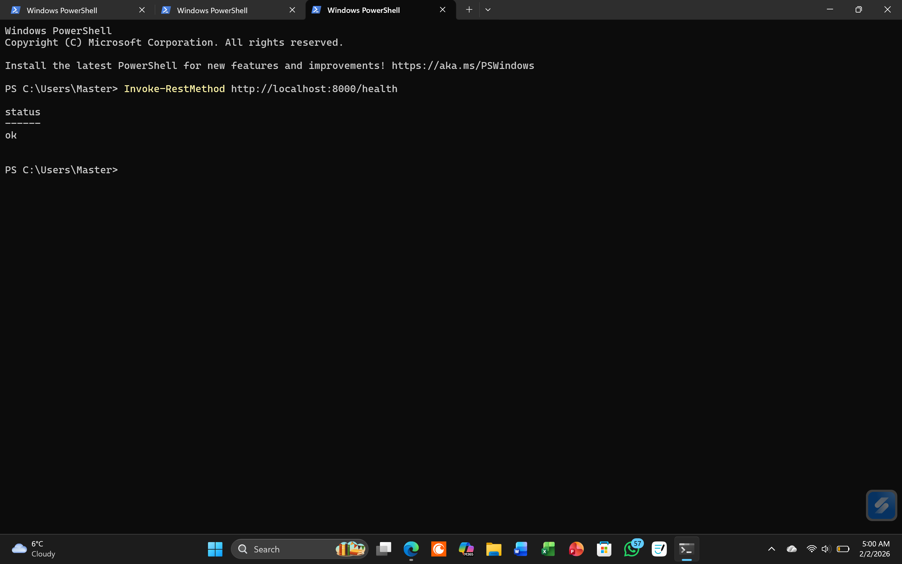
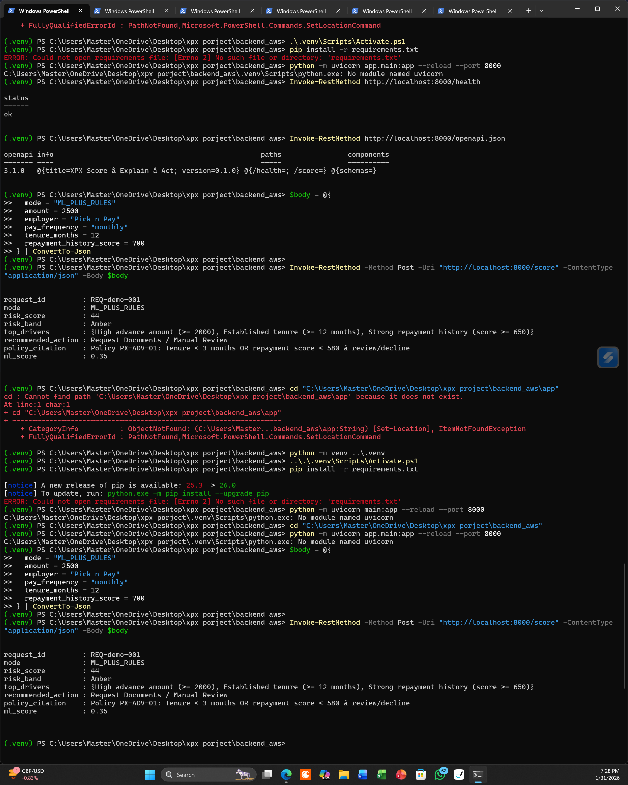
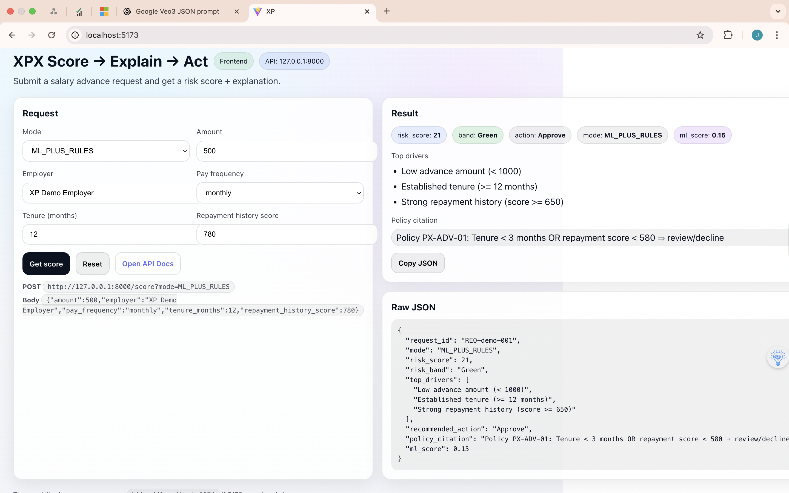

# XPX — Score → Explain → Act

### Explainable salary-advance risk decisioning (portfolio demo)


> Submit a salary-advance request → get a **risk score**, see **why** (top drivers + the policy that fired), and receive a **recommended action** (Approve / Review / Decline).

This repository consolidates two earlier repos for the same project — `xpx-score-explain-act` (README + evidence) and `xpx-grounded-rag-demo` (the working code) — into a single, runnable codebase.

---

## What it is

A small, full-stack **risk-decisioning engine** that mirrors how fintech / payroll / lending systems turn an application into an *auditable* decision instead of an opaque score:

1. **Score** — a hybrid of deterministic business rules and a model-style signal produces a 0–100 risk score.
2. **Explain** — the response returns the top contributing drivers and the exact policy citation.
3. **Act** — the score maps to a Green / Amber / Red band and an Approve / Review / Decline recommendation.

The backend is a FastAPI service; the frontend is a React + Vite UI for exercising it. It runs entirely locally on synthetic inputs — **no real personal or financial data**.

---

## Implementation status (what's real vs. designed)

Being explicit about this is deliberate — the decisioning flow is built and tested; the cloud/ML platform around it is a design.

| Capability | Status |
| --- | --- |
| `GET /health` + `POST /score` FastAPI service | ✅ Implemented & tested |
| Hybrid rules + model-style scoring, 0–100 | ✅ Implemented |
| Explainability: top drivers + policy citation | ✅ Implemented |
| React + Vite UI (form → score → explanation → raw JSON) | ✅ Implemented |
| pytest suite, Dockerfiles, docker-compose, CI workflow | ✅ Implemented |
| Trained ML model (e.g. GBDT) replacing the stub signal | 🎯 Roadmap |
| RAG-grounded policy retrieval (vector/keyword search) | 🎯 Roadmap |
| Azure-native production platform (see architecture below) | 📐 Designed, not deployed |
| Audit-log persistence, drift/fairness monitoring, RBAC | 📐 Designed, not deployed |

The "model" signal is currently a transparent, deterministic stub so the *combination* of model + rules is demonstrable end-to-end; swapping in a real model is the next step and does not change the API contract.

---

## Evidence

Running locally — full set in [`docs/screenshots/`](docs/screenshots).

| Health check | Explainable score response | Frontend result |
| --- | --- | --- |
|  |  |  |

---

## Architecture

The diagram below is an **Azure-native reference architecture I designed** for how this decisioning logic would be deployed and scaled in production (EU hosting, GDPR-first, synthetic data only). It represents the target design — **not a deployed environment**. The code in this repo implements the core Score → Explain → Act logic that sits at the centre of it.


Full six-layer walkthrough: [`docs/architecture.md`](docs/architecture.md).

---

## API

### `GET /health`
```json
{ "status": "ok" }
```

### `POST /score?mode=ML_PLUS_RULES`
`mode` is `RULES_ONLY` or `ML_PLUS_RULES` (default).

Request:
```json
{
  "amount": 2500,
  "employer": "XP Demo Employer",
  "pay_frequency": "monthly",
  "tenure_months": 12,
  "repayment_history_score": 700
}
```

Response:
```json
{
  "request_id": "REQ-demo-001",
  "mode": "ML_PLUS_RULES",
  "risk_score": 44,
  "risk_band": "Amber",
  "top_drivers": [
    "High advance amount (>= 2000)",
    "Established tenure (>= 12 months)",
    "Strong repayment history (score >= 650)"
  ],
  "recommended_action": "Request Documents / Manual Review",
  "policy_citation": "Policy PX-ADV-01: Tenure < 3 months OR repayment score < 580 ⇒ review/decline",
  "ml_score": 0.35
}
```

Interactive docs (Swagger/OpenAPI) at `http://127.0.0.1:8000/docs`.

---

## Getting started

**Prerequisites:** Python 3.10+, Node.js 18+, npm. (Docker optional.)

### Backend
```bash
cd backend
python -m venv .venv && source .venv/bin/activate    # Windows: .\.venv\Scripts\activate
pip install -r requirements.txt
uvicorn app.main:app --reload --port 8000
```

### Frontend (new terminal)
```bash
cd frontend
npm install
npm run dev            # serves http://localhost:5173
```

### Both at once (from repo root)
```bash
npm install            # installs 'concurrently'
npm run dev
```

### With Docker
```bash
docker compose up --build
# backend → http://localhost:8000 , frontend → http://localhost:5173
```

### Tests
```bash
cd backend
pip install -r requirements-dev.txt
pytest
```

---

## Tech stack

**Backend:** Python · FastAPI · Uvicorn · Pydantic
**Frontend:** React 19 · Vite · Fetch API
**Tooling:** pytest · ruff · Docker / docker-compose · GitHub Actions

---

## Repository structure

```
xpx/
├── backend/
│   ├── app/main.py            # FastAPI: /health, /score, rules + model-stub, explainability
│   ├── tests/test_api.py      # pytest suite
│   ├── requirements.txt
│   ├── requirements-dev.txt
│   └── Dockerfile
├── frontend/                  # React + Vite UI
│   ├── src/App.jsx
│   └── Dockerfile
├── docs/
│   ├── architecture.md        # six-layer design walkthrough
│   ├── architecture/          # architecture diagram
│   ├── adr/                   # architecture decision records
│   └── screenshots/           # running evidence (indexed)
├── .github/workflows/ci.yml   # lint + test (backend) · lint + build (frontend)
├── docker-compose.yml
└── package.json               # root dev orchestrator
```

---

## Design decisions

Recorded as lightweight ADRs:
- [ADR-0001 — Hybrid rules + model scoring](docs/adr/0001-hybrid-rules-plus-ml.md)
- [ADR-0002 — Synthetic data only](docs/adr/0002-synthetic-data-only.md)

---

## Security & compliance notes
- No secrets in code — configuration via environment variables (`.env` is git-ignored; see `frontend/.env.example`).
- Synthetic inputs only; no real PII.
- Deterministic, explainable decision logic with policy citations for auditability.
- Structured JSON responses suitable for downstream audit logging.

---

## Notes & scope
- Portfolio / demonstration project. The scoring is illustrative, not production-grade.
- Do not submit real personal or financial data.

## License
MIT — see [LICENSE](LICENSE).
